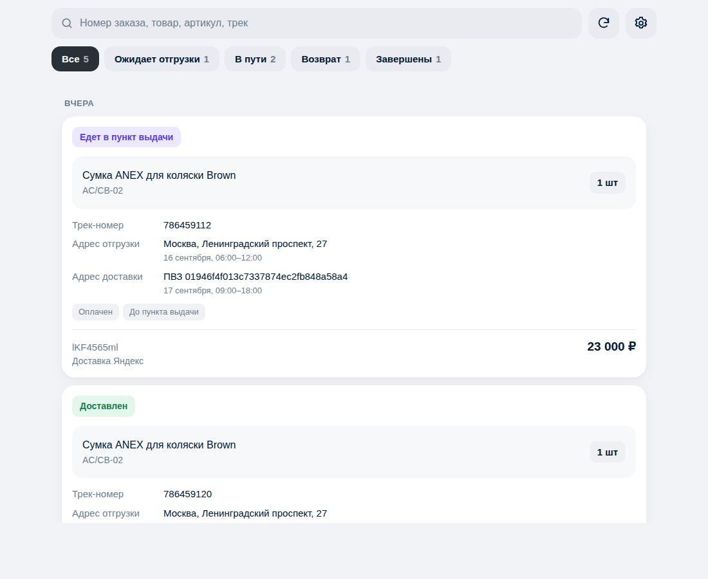

# Панель интернет-заказов — Яндекс Доставка

Веб-панель для работы с интернет-заказами: список заказов из API Яндекс Доставки
(«Доставка в другой день», боевой контур `b2b-authproxy.taxi.yandex.net`), поиск
по товарам и разделы по стадиям доставки.



## Возможности

1. **Поиск** — по номеру заказа, названию товара, артикулу, трек-номеру,
   штрихкоду грузоместа, адресу и получателю. Ищет по всем словам запроса сразу.
2. **Разделы** — Все · Ожидает отгрузки · В пути · Возврат · Завершены,
   со счётчиками по текущему поисковому запросу.
3. **Список заказов**, сгруппированный по дате доставки. В карточке:
   * статус;
   * название товара, артикул, количество;
   * стоимость;
   * трек-номер (номер заказа у оператора);
   * адрес отгрузки (склад) и интервал;
   * адрес доставки (курьером или ПВЗ) и интервал.

Клик по карточке открывает подробности: история статусов, получатель,
грузоместа, ссылка на трекинг для получателя и печать ярлыка (PDF).

Технически: Node.js 20+, **без внешних зависимостей** (`node:http` + `fetch`),
фронтенд — статика без сборки.

## Методы API, которые использует панель

| Метод | Назначение |
|---|---|
| `POST /api/b2b/platform/requests/info` | список заявок за интервал (основная выборка) |
| `GET /api/b2b/platform/request/info` | карточка заявки |
| `GET /api/b2b/platform/request/history` | история статусов |
| `GET /api/b2b/platform/request/actual_info` | актуальная дата и интервал доставки |
| `POST /api/b2b/platform/warehouses/list` | справочник складов для адресов отгрузки |
| `POST /api/b2b/platform/request/generate-labels` | ярлык в PDF |

Токен передаётся заголовком `Authorization: Bearer <OAuth-токен>`.
Получить токен: [личный кабинет](https://dostavka.yandex.ru/account2/integration) → **Интеграция** → «Получить токен».

## Развёртывание одной командой

```bash
curl -fsSL https://raw.githubusercontent.com/kkkola000/site/claude/nifty-sagan-m384gm/deploy/bootstrap.sh \
  | sudo bash -s -- --port 3010 --base-path /anex-orders --attach-site auto --allow-subnet 10.66.66.0/24
```

Токен API указывать не нужно — он вводится в самой панели: **⚙ Настройки → Токен API → Сохранить**.
Токен хранится на сервере в `config/settings.json` с правами 600, в браузер обратно не отдаётся
(показывается только маска вида `y2_A…f8Qd`), применяется сразу, без перезапуска службы.
Рядом есть кнопка «Проверить связь».

Пароль панели скрипт генерирует сам и печатает в конце — сохраните его.

## Как открыть панель

| Способ | Команда | Адрес |
|---|---|---|
| Путём в существующем сайте | `--base-path /anex-orders --attach-site auto` | `https://seller.anex-online.kz/anex-orders/` |
| Отдельный поддомен | `--nginx --domain orders.anex-online.kz` | `https://orders.anex-online.kz/` |
| Без nginx, по адресу в туннеле | `--bind 10.66.66.1` | `http://10.66.66.1:3010/` |

По умолчанию (без этих флагов) панель слушает `127.0.0.1:3010` и снаружи недоступна —
это безопасный вариант, но открыть её можно только через nginx.

**Про `--attach-site`.** Скрипт читает действующую конфигурацию через `nginx -T`
и находит нужный файл: по домену (`--domain`), иначе по `proxy_pass` на порт соседней
панели. Дальше добавляет блок `location /anex-orders/` между маркерами, делает
резервную копию, проверяет `nginx -t` и откатывает файл, если проверка не прошла.
Повторный запуск не плодит дубли, `--detach-site` убирает блок.

Если сайт определить не удалось, скрипт покажет все сайты сервера и попросит указать
домен или файл. Тот же список отдельно:

```bash
sudo bash deploy/deploy.sh --list-sites
```

**Plesk.** Если домен обслуживается Plesk, прямые правки конфигов затираются при
пересборке, поэтому директивы пишутся в `/var/www/vhosts/system/ДОМЕН/conf/vhost_nginx.conf`
и выполняется `plesk sbin httpdmng --reconfigure-domain` — это переживает пересборку.

Важно: файл сайта панели Ozon Pack пересоздаётся её собственным скриптом `deploy/ssl.sh`.
Если его запустить, наш блок исчезнет — просто повторите команду развёртывания, путь вернётся.
Вариант без этой оговорки — отдельный поддомен или `--bind`.

## Развёртывание на сервере

На сервере уже работает другая панель и настроен nginx, вход — по VPN,
поэтому скрипт **по умолчанию не трогает конфигурацию nginx**: он ставит сервис
на локальный порт и печатает готовый блок конфигурации для вставки вручную.

```bash
git clone <репозиторий> /tmp/anex-orders && cd /tmp/anex-orders

# Панель как отдельный сервис на порту 3010
sudo bash deploy/deploy.sh --token 'y2_...' --port 3010

# Либо подпутём внутри существующего домена (seller.anex-online.kz/orders)
sudo bash deploy/deploy.sh --token 'y2_...' --port 3010 --base-path /orders
```

Скрипт:

* ставит Node.js 20 (NodeSource), если его нет;
* заводит системного пользователя и каталог `/opt/anex-orders`;
* создаёт `.env` (права `600`), генерирует пароль панели, если он не задан;
* ставит и запускает systemd-сервис `anex-orders` с ограничением прав;
* проверяет, что порт свободен, и что панель отвечает после старта;
* печатает блок nginx для вставки в существующий конфиг.

Повторный запуск = обновление: файлы перезаписываются, `.env` сохраняется,
сервис перезапускается.

Полный список опций: `bash deploy/deploy.sh --help`.

### Публикация через существующий nginx

Панель слушает `127.0.0.1`, наружу её отдаёт nginx. Для подпути:

```nginx
location /orders/ {
    proxy_pass http://127.0.0.1:3010/orders/;
    proxy_http_version 1.1;
    proxy_set_header Host $host;
    proxy_set_header X-Real-IP $remote_addr;
    proxy_set_header X-Forwarded-For $proxy_add_x_forwarded_for;
    proxy_set_header X-Forwarded-Proto $scheme;
    proxy_read_timeout 120s;
}
location = /orders { return 301 /orders/; }
```

Для отдельного поддомена — шаблон в `deploy/nginx.conf`.
Панель одинаково работает и когда nginx передаёт префикс, и когда срезает его.

## Соседство с панелью Ozon Pack

На том же сервере работает [ozon-pack](https://github.com/kkkola000/ozon-pack) —
панель сборки заказов Ozon. Ресурсы у панелей разведены полностью:

| | Ozon Pack | Панель заказов |
|---|---|---|
| Каталог | `/opt/ozon-pack` | `/opt/anex-orders` |
| Служба | `ozon-pack` | `anex-orders` |
| Пользователь | `ozon` | `anexorders` |
| Порт | 8080 | 3010 |
| Сайт nginx | `sites-available/ozon-pack` | `sites-available/anex-orders` |
| Правила доступа | `snippets/ozon-pack-access.conf` | `snippets/anex-orders-access.conf` |
| Среда | Python + venv | Node.js |

Скрипт развёртывания проверяет это сам: находит соседнюю панель, читает её порт
из `/opt/ozon-pack/.env` и останавливается, если совпали порт, каталог, служба,
пользователь или домен.

**Чего делать нельзя:** добавлять `location /orders/` в сайт nginx панели Ozon Pack.
Её скрипт `deploy/ssl.sh` пересоздаёт этот файл целиком при каждом запуске
(в шапке файла так и написано: «Правки перезапишутся при повторном запуске»),
поэтому вставленный блок исчезнет при следующем обновлении или перевыпуске
сертификата. Нужен отдельный сайт nginx — его создаёт `--nginx --domain ...`.

**Доступ по VPN.** Ozon Pack ограничивает вход подсетью туннеля через
`vpn-only.sh`. Скрипт развёртывания берёт этот же список сетей (из `IP_ALLOWLIST`
в `/opt/ozon-pack/.env`, иначе из его снипета nginx) и пишет собственный файл
правил, не трогая чужой. Сеть туннеля можно задать явно:

```bash
sudo bash deploy/deploy.sh --token 'y2_...' --nginx --domain orders.anex-online.kz \
     --allow-subnet 10.66.66.0/24
```

Адрес клиента приводится к сети автоматически: `10.66.66.2/24` → `10.66.66.0/24`.
Это важно, потому что `allow 10.66.66.2/24` роняет проверку конфигурации nginx
(«low address bits are meaningless»), а nginx на сервере общий с панелью Ozon Pack.
Запись, которую не удалось разобрать, в конфиг не попадает — о ней скрипт
предупредит.

Список сохраняется в `.env` панели, поэтому повторное развёртывание без флага
не открывает доступ заново. Если сети найти не удалось, скрипт скажет об этом
прямо, а не сделает вид, что панель закрыта: вход останется под паролем панели.

Сертификаты: при доступе по VPN Let's Encrypt не нужен. Если всё же запускать
с `--ssl`, скрипт предупредит о том, что продление у Ozon Pack уже настроено
собственным таймером `certbot-renew.timer`.

### Эксплуатация

```bash
systemctl status anex-orders      # состояние
journalctl -u anex-orders -f      # журнал
systemctl restart anex-orders     # после правки .env
```

## Настройки (`.env`)

| Переменная | Назначение |
|---|---|
| `YANDEX_OAUTH_TOKEN` | OAuth-токен. Необязателен: обычно вводится в панели (⚙ Настройки) |
| `YANDEX_API_BASE` | хост API, по умолчанию `https://b2b-authproxy.taxi.yandex.net` |
| `YANDEX_STATION_IDS` | показывать только заказы с этих складов (через запятую) |
| `AUTH_USER` / `AUTH_PASSWORD` | вход в панель (Basic-авторизация); пусто — без пароля |
| `PORT` / `HOST` | адрес прослушивания, по умолчанию `127.0.0.1:3010` |
| `BASE_PATH` | подпуть, если панель встроена в существующий домен |
| `ORDERS_LOOKBACK_DAYS` | глубина выборки заказов, по умолчанию 60 дней |
| `ORDERS_LIMIT` | максимум заказов в выдаче, по умолчанию 500 |
| `CACHE_TTL_SECONDS` | кэш ответов API, по умолчанию 60 с |
| `REQUEST_TIMEOUT_MS` | таймаут запроса к API, по умолчанию 15000 мс |

### Адреса ПВЗ

Адреса складов подтягиваются из `warehouses/list`. Пункты выдачи в этот список
не входят — для них API отдаёт только `platform_id`. Чтобы в карточке был
человекочитаемый адрес, заполните `config/stations.json`
(образец — `config/stations.example.json`):

```json
{ "01946f4f013c7337874ec2fb848a58a4": { "name": "ПВЗ", "address": "Москва, Ленинградский проспект, 37 к9" } }
```

## Разработка

```bash
npm test                 # 19 тестов: нормализация, статусы, API, скрипт развёртывания
node scripts/preview.mjs # предпросмотр интерфейса на демо-данных: http://127.0.0.1:4173
npm start                # боевой запуск (нужен .env с токеном)
```

## Как статусы раскладываются по разделам

Соответствие «статус API → раздел панели» собрано в одном месте — `server/statuses.js`,
по [статусной модели](https://yandex.ru/support/delivery-profile/ru/api/other-day/status-model)
«Доставки в другой день» (обе ветки: до двери и до ПВЗ).

| Раздел | Статусы |
|---|---|
| **Ожидает отгрузки** | `VALIDATING_ERROR`, `CREATED`, `DELIVERY_PROCESSING_STARTED`, `SORTING_CENTER_LOADED` |
| **В пути** | `SORTING_CENTER_AT_START`, `SORTING_CENTER_PREPARED`, `SORTING_CENTER_TRANSMITTED`, `DELIVERY_AT_START`, `DELIVERY_AT_START_SORT`, `DELIVERY_TRANSPORTATION`, `DELIVERY_TRANSPORTATION_RECIPIENT`, `DELIVERY_ARRIVED_PICKUP_POINT`, `CONFIRMATION_CODE_RECEIVED`, `DELIVERY_TIME_INTERVALS_UPDATED`, `DELIVERY_ATTEMPT_FAILED` |
| **Возврат** | `SORTING_CENTER_RETURN_RETURNED`, `RETURN_TRANSPORTATION_STARTED`, `RETURN_ARRIVED_DELIVERY`, `RETURN_READY_FOR_PICKUP`, `RETURN_RETURNED` |
| **Завершены** | `DELIVERY_TRANSMITTED_TO_RECIPIENT`, `PARTICULARLY_DELIVERED`, `DELIVERY_DELIVERED`, `CANCELLED` |

Граница между «Ожидает отгрузки» и «В пути» — `SORTING_CENTER_AT_START`:
до него заказ ещё оформляется, после — физически принят в сортировочном центре.

`VALIDATING_ERROR` и `DELIVERY_ATTEMPT_FAILED` подсвечиваются красным бейджем
как требующие внимания. Основные статусы цепочки (в документации выделены
жирным) отмечены в истории заказа полужирным, статусы детализации — обычным.

Незнакомый статус определяется по шаблону имени (`*RETURN*` → Возврат,
`*DELIVERY*` → В пути и т. д.), поэтому новый статус в API не ломает фильтрацию.
